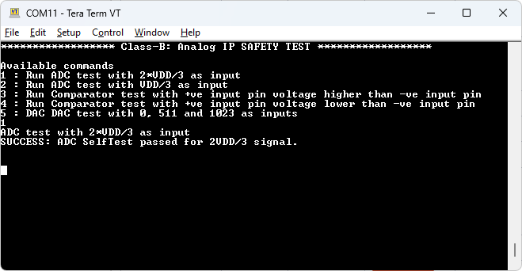

# Class-B Safety Test: Analog peripherals

This code example demonstrates the use of the Class-B Safety Test Library to test the analog peripherals such as, comparator ADC and DAC in the PSoC&trade; Control C3 MCU. The example verifies the proper operation and accuracy of these peripherals adhering to the safty standards.


[View this README on GitHub.](https://github.com/Infineon/mtb-example-ce241079-safety-analog-test)

[Provide feedback on this code example.](https://cypress.co1.qualtrics.com/jfe/form/SV_1NTns53sK2yiljn?Q_EED=eyJVbmlxdWUgRG9jIElkIjoiQ0UyNDEwNzkiLCJTcGVjIE51bWJlciI6IjAwMi00MTA3OSIsIkRvYyBUaXRsZSI6IkNsYXNzLUIgU2FmZXR5IFRlc3Q6IEFuYWxvZyBwZXJpcGhlcmFscyIsInJpZCI6Imtvb3poYW1wYXJhbSIsIkRvYyB2ZXJzaW9uIjoiMS4wLjAiLCJEb2MgTGFuZ3VhZ2UiOiJFbmdsaXNoIiwiRG9jIERpdmlzaW9uIjoiTUNEIiwiRG9jIEJVIjoiSUNXIiwiRG9jIEZhbWlseSI6IlBTT0MifQ==)

## Requirements

- [ModusToolbox&trade;](https://www.infineon.com/modustoolbox) v3.4 or later (tested with v3.4)
- Board support package (BSP) minimum required version: v1.3.0
- Programming language: C
- Associated parts: All PSOC&trade; Control C3 MCUs


## Supported toolchains (make variable 'TOOLCHAIN')

- GNU Arm&reg; Embedded Compiler v11.3.1 (`GCC_ARM`) – Default value of `TOOLCHAIN`
- Arm® Compiler v6.22 (`ARM`)
- IAR C/C++ Compiler v9.50.2 (`IAR`)

## Supported kits (make variable 'TARGET')

- [PSOC&trade; Control C3M5 Evaluation Kit](https://www.infineon.com/KIT_PSC3M5_EVK) (`KIT_PSC3M5_EVK`) – Default value of `TARGET`

## Hardware setup

This example requires minor hardware setup based on the test modes supported. Refer the kit user guide to ensure that the setup is done correctly.

Two analog peripherals are tested in this code example, for that four different tests are vailable. The hardware setup for each tests are as follows:

1. ADC test using 2*VDD/3 as input: In this test, a voltage of 2*VDD/3 is to be provided to the pin configured as the input to the ADC. Here connect the input to the pin 'AN_A4'. 
   <br>
2. ADC test using VDD/3 as input: In this test, a voltage of VDD/3 is to be provided to the pin configured as the input to the ADC. Here connect the input to the pin 'AN_A4'. 
   <br>
3. Comparator test to test high output: In this test, an input on the +ve (P8.0) pin which is higher than the -ve (P8.1) pin is provided to the comparator. For that connect P8.1 to ground and P8.0 to a +ve voltage.
   <br>
4. Comparator test to test low output: In this test, an input on the +ve (P8.0) pin which is lower than the -ve (P8.1) pin is provided to the comparator. For that connect P8.0 to ground and P8.0 to a +ve voltage.
   <br>
   
## Software setup

See the [ModusToolbox&trade; tools package installation guide](https://www.infineon.com/ModusToolboxInstallguide) for information about installing and configuring the tools package.

Install a terminal emulator if you don't have one. Instructions in this document use [Tera Term](https://teratermproject.github.io/index-en.html).

This example requires no additional software or tools.


## Using the code example


### Create the project

The ModusToolbox&trade; tools package provides the Project Creator as both a GUI tool and a command line tool.

<details><summary><b>Use Project Creator GUI</b></summary>

1. Open the Project Creator GUI tool.

   There are several ways to do this, including launching it from the dashboard or from inside the Eclipse IDE. For more details, see the [Project Creator user guide](https://www.infineon.com/ModusToolboxProjectCreator) (locally available at *{ModusToolbox&trade; install directory}/tools_{version}/project-creator/docs/project-creator.pdf*).

2. On the **Choose Board Support Package (BSP)** page, select a kit supported by this code example. See [Supported kits](#supported-kits-make-variable-target).

   > **Note:** To use this code example for a kit not listed here, you may need to update the source files. If the kit does not have the required resources, the application may not work.

3. On the **Select Application** page:

   a. Select the **Applications(s) Root Path** and the **Target IDE**.

      > **Note:** Depending on how you open the Project Creator tool, these fields may be pre-selected for you.

   b. Select this code example from the list by enabling its check box.

      > **Note:** You can narrow the list of displayed examples by typing in the filter box.

   c. (Optional) Change the suggested **New Application Name** and **New BSP Name**.

   d. Click **Create** to complete the application creation process.

</details>


<details><summary><b>Use Project Creator CLI</b></summary>

The 'project-creator-cli' tool can be used to create applications from a CLI terminal or from within batch files or shell scripts. This tool is available in the *{ModusToolbox&trade; install directory}/tools_{version}/project-creator/* directory.

Use a CLI terminal to invoke the 'project-creator-cli' tool. On Windows, use the command-line 'modus-shell' program provided in the ModusToolbox&trade; installation instead of a standard Windows command-line application. This shell provides access to all ModusToolbox&trade; tools. You can access it by typing "modus-shell" in the search box in the Windows menu. In Linux and macOS, you can use any terminal application.

The following example clones the "[Analog peripherals test](https://github.com/Infineon/mtb-example-ce241079-safety-analog-test)" application with the desired name "Analog_Test" configured for the *KIT_PSC3M5_EVK* BSP into the specified working directory *C:/mtb_projects*:

   ```
   project-creator-cli --board-id KIT_PSC3M5_EVK --app-id mtb-example-ce241079-safety-analog-test --user-app-name Analog_Test --target-dir "C:/mtb_projects"
   ```


The 'project-creator-cli' tool has the following arguments:

Argument | Description | Required/optional
---------|-------------|-----------
`--board-id` | Defined in the <id> field of the [BSP](https://github.com/Infineon?q=bsp-manifest&type=&language=&sort=) manifest | Required
`--app-id`   | Defined in the <id> field of the [CE](https://github.com/Infineon?q=ce-manifest&type=&language=&sort=) manifest | Required
`--target-dir`| Specify the directory in which the application is to be created if you prefer not to use the default current working directory | Optional
`--user-app-name`| Specify the name of the application if you prefer to have a name other than the example's default name | Optional

<br>

> **Note:** The project-creator-cli tool uses the `git clone` and `make getlibs` commands to fetch the repository and import the required libraries. For details, see the "Project creator tools" section of the [ModusToolbox&trade; tools package user guide](https://www.infineon.com/ModusToolboxUserGuide) (locally available at {ModusToolbox&trade; install directory}/docs_{version}/mtb_user_guide.pdf).

</details>


### Open the project

After the project has been created, you can open it in your preferred development environment.


<details><summary><b>Eclipse IDE</b></summary>

If you opened the Project Creator tool from the included Eclipse IDE, the project will open in Eclipse automatically.

For more details, see the [Eclipse IDE for ModusToolbox&trade; user guide](https://www.infineon.com/MTBEclipseIDEUserGuide) (locally available at *{ModusToolbox&trade; install directory}/docs_{version}/mt_ide_user_guide.pdf*).

</details>


<details><summary><b>Visual Studio (VS) Code</b></summary>

Launch VS Code manually, and then open the generated *{project-name}.code-workspace* file located in the project directory.

For more details, see the [Visual Studio Code for ModusToolbox&trade; user guide](https://www.infineon.com/MTBVSCodeUserGuide) (locally available at *{ModusToolbox&trade; install directory}/docs_{version}/mt_vscode_user_guide.pdf*).

</details>


<details><summary><b>Command line</b></summary>

If you prefer to use the CLI, open the appropriate terminal, and navigate to the project directory. On Windows, use the command-line 'modus-shell' program; on Linux and macOS, you can use any terminal application. From there, you can run various `make` commands.

For more details, see the [ModusToolbox&trade; tools package user guide](https://www.infineon.com/ModusToolboxUserGuide) (locally available at *{ModusToolbox&trade; install directory}/docs_{version}/mtb_user_guide.pdf*).

</details>


## Operation

1. Connect the board to your PC using the provided USB cable through the KitProg3 USB connector.

2. Open a terminal program and select the KitProg3 COM port. Set the serial port parameters to 8N1 and 115200 baud.

3. Program the board using one of the following:

   <details><summary><b>Using Eclipse IDE</b></summary>

      1. Select the application project in the Project Explorer.

      2. In the **Quick Panel**, scroll down, and click **\<Application Name> Program (KitProg3_MiniProg4)**.
   </details>


   <details><summary><b>In other IDEs</b></summary>

   Follow the instructions in your preferred IDE.
   </details>


   <details><summary><b>Using CLI</b></summary>

     From the terminal, execute the `make program` command to build and program the application using the default toolchain to the default target. The default toolchain is specified in the application's Makefile but you can override this value manually:
      ```
      make program TOOLCHAIN=<toolchain>
      ```

      Example:
      ```
      make program TOOLCHAIN=GCC_ARM
      ```
   </details>

4. After programming, the application starts automatically. Confirm that **Class-B: Analog IP SAFETY TEST** is displayed on the UART terminal along with the available commands.

   **Figure 1. Terminal output on program startup**

   


5. To run the self-test commands, enter the following: 
      - **1 ** For ADC test with 2*VDD/3 as input
      - **2 ** For ADC test with VDD/3 as input
      - **3 ** For Comparator test with +ve input pin voltage higher than -ve input pin
      - **4 ** For Comparator test with +ve input pin voltage lower than -ve input pin
      - **5 ** DAC test with 0, 511 and 1023 as inputs
      

6. Make connections as explained in the [Hardware setup](#hardware-setup) for the test going to execute.

7. When the command '1' is executed by providing 2*VDD/3 volt on the pin AN_A4, it will display SUCCESS as shown in the Figure 2.

   **Figure 2. Terminal output on successfull execution of ADC test with 2*VDD/3 as input **

   
   
   If the input voltage is not in the range or if the ADC has some problems, then it will display Error as shown in the Figure 3.

   **Figure 3. Terminal output on failure in the execution of ADC test with 2*VDD/3 as input **

   

8. Similarly, for the successfull execution of command 2, it will show the response shown in Figure 4.

   **Figure 4. Terminal output on successfull execution of ADC test with VDD/3 as input **

   

9. For the successfull execution of command 3, it will show the response shown in Figure 5.

   **Figure 5. Terminal output on successfull execution of comparator test with +ve input hgiher than -ve input **

   
  
10. For the successfull execution of command 4, it will show the response shown in Figure 6.

   **Figure 6. Terminal output on successfull execution of comparator test with +ve input lower than -ve input **

   

11. For the successfull execution of command 5, it will show the response shown in Figure 7.

   **Figure 7. Terminal output on successfull execution of DAC test **

   

## Debugging

You can debug the example to step through the code.


<details><summary><b>In Eclipse IDE</b></summary>

Use the **\<Application Name> Debug (KitProg3_MiniProg4)** configuration in the **Quick Panel**. For details, see the "Program and debug" section in the [Eclipse IDE for ModusToolbox&trade; user guide](https://www.infineon.com/MTBEclipseIDEUserGuide).

</details>

<details><summary><b>In other IDEs</b></summary>

Follow the instructions in your preferred IDE.

</details>


## Design and implementation

The example demonstrates tests for two key analog peripherals: ADC and comparator in the PSoC&trade; Control C3 MCU. It utilizes the Class-B Safety Test Library to execute these tests. See the [Hardware setup](#hardware-setup) section for detailed connection instructions.

The example starts by initializing the BSP configuration according to the design.modus configurations and setting up the retarget-io for debug prints. The CPU then waits for the commands entered from the serial terminal. When it is received, the code parses the commands that have been sent and performs the tests.

   - **Command `1` - ADC test with 2*VDD/3 as input **:
     - This test is for the analog-to-digital converter (ADC). It expects the user to provide the required voltage to the selected ADC input.
     - A function is implemented in STL to measure the voltage on a specific channel and compare it against the expected result with an accuracy range provided to the function. If the measured value is within the provided range from the exepected digital value, then it returns test success else it returns failure. Command 1 expects read value 2200 for the input 2*VDD/3. The range set for it is 396.
     
   - **Command `2` - ADC test with VDD/3 as input**:
     - This test is for the analog-to-digital converter (ADC). It expects the user to provide the required voltage to the selected ADC input.
     - A function is implemented in STL to measure the voltage on a specific channel and compare it against the expected result with an accuracy range provided to the function. If the measured value is within the provided range from the exepected digital value, then it returns test success else it returns failure. Command 1 expects read value 1100 for the input VDD/3. The range set for it is 396.

   - **Command `3` - Comparator test with +ve input pin voltage higher than -ve input pin**:
     - This test focuses on the analog comparator. It expects the user to provide the required inputs to the +ve and -ve inputs of the comparator.
     - A function is implemented in STL to read the comparator output and check whether is aligns with the expected result. A higher voltage on the positive input of the comparator than on the -ve input is expected in this test. So the exepcted output passed to this function is a '1'. 

   - **Command `4` - Comparator test with +ve input pin voltage lower than -ve input pin**:
     - This test focuses on the analog comparator. It expects the user to provide the required inputs to the +ve and -ve inputs of the comparator.
     - A function is implemented in STL to read the comparator output and check whether is aligns with the expected result. A lower voltage on the positive input of the comparator than on the -ve input is expected in this test. So the exepcted output passed to this function is a '0'. 

   - **Command `5` - DAC test**:
     - This test focuses on the DAC in the CSG. 
     - A function is implemented in STL to configure and initialise the DAC and ADC. The function then sets the DAC value and triggers the conversion. When the DAC conversion is over, triggers ADC conversion and the DAC output will be read. This read value will be checked against the provided reference values.

By executing these tests, the example ensures the proper functioning of the analog peripheral, providing valuable insights into the performance and reliability of the PSoC&trade; Control C3 MCU. The test results are displayed on the console, facilitating easy evaluation and troubleshooting.


### Resources and settings

**Table 1. Application resources**

 Resource  |  Alias/object     |    Purpose
 :-------- | :-------------    | :------------
 UART (HAL)| CYBSP_UART | UART HAL object used by retarget-IO for the debug UART port
 SAR (PDL) | CYBSP_SAR_ADC | ADC used for performing self-test for ADC
 LPCOMP (PDL) | CYBSP_LPCOMP | LPCOMP used to perform self-test for comparator
 CSG DAC(PDL) | CYBSP_DAC | CSG Slice used to perform the self test for DAC

<br>

## Related resources

Resources  | Links
-----------|----------------------------------
Application notes  | [AN238329](https://www.infineon.com/AN238329) – Getting started with PSOC&trade; Control C3 MCU on ModusToolbox&trade; software <br>
Code examples  | [Using ModusToolbox&trade;](https://github.com/Infineon/Code-Examples-for-ModusToolbox-Software) on GitHub
Device documentation | [PSOC&trade; Control C3 MCU datasheet](https://www.infineon.com/cms/en/product/microcontroller/32-bit-psoc-arm-cortex-microcontroller/32-bit-psoc-control-arm-cortex-m33-mcu/psoc-control-c3p/#!documents) <br> [PSOC&trade; Control C3 technical reference manuals](https://www.infineon.com/cms/en/product/microcontroller/32-bit-psoc-arm-cortex-microcontroller/32-bit-psoc-control-arm-cortex-m33-mcu/psoc-control-c3p/#!documents)
Development kits | Select your kits from the [Evaluation board finder](https://www.infineon.com/cms/en/design-support/finder-selection-tools/product-finder/evaluation-board).
Libraries on GitHub  | [mtb-pdl-cat1](https://github.com/Infineon/mtb-pdl-cat1) – Peripheral Driver Library (PDL) <br> [mtb-hal-psc3](https://github.com/Infineon/mtb-hal-psc3) – Hardware Abstraction Layer (HAL) library <br> [retarget-io](https://github.com/Infineon/retarget-io) – Utility library to retarget STDIO messages to a UART port <br> [mtb-stl](https://github.com/Infineon/mtb-stl) - Safety Test Library (STL)
Tools  | [ModusToolbox&trade;](https://www.infineon.com/modustoolbox) – ModusToolbox&trade; software is a collection of easy-to-use libraries and tools enabling rapid development with Infineon MCUs for applications ranging from wireless and cloud-connected systems, edge AI/ML, embedded sense and control, to wired USB connectivity using PSoC&trade; Industrial/IoT MCUs, AIROC&trade; Wi-Fi and Bluetooth&reg; connectivity devices, XMC&trade; Industrial MCUs, and EZ-USB&trade;/EZ-PD&trade; wired connectivity controllers. ModusToolbox&trade; incorporates a comprehensive set of BSPs, HAL, libraries, configuration tools, and provides support for industry-standard IDEs to fast-track your embedded application development.

<br>


## Other resources

Infineon provides a wealth of data at [www.infineon.com](https://www.infineon.com) to help you select the right device, and quickly and effectively integrate it into your design.


## Document history

Document title: *CE241079* – *Class-B safety test: Analog peripherals*

 Version | Description of change
 ------- | ---------------------
 1.0.0   | New code example

<br>

All referenced product or service names and trademarks are the property of their respective owners.

The Bluetooth&reg; word mark and logos are registered trademarks owned by Bluetooth SIG, Inc., and any use of such marks by Infineon is under license.


---------------------------------------------------------

© Cypress Semiconductor Corporation, 2024. This document is the property of Cypress Semiconductor Corporation, an Infineon Technologies company, and its affiliates ("Cypress").  This document, including any software or firmware included or referenced in this document ("Software"), is owned by Cypress under the intellectual property laws and treaties of the United States and other countries worldwide.  Cypress reserves all rights under such laws and treaties and does not, except as specifically stated in this paragraph, grant any license under its patents, copyrights, trademarks, or other intellectual property rights.  If the Software is not accompanied by a license agreement and you do not otherwise have a written agreement with Cypress governing the use of the Software, then Cypress hereby grants you a personal, non-exclusive, nontransferable license (without the right to sublicense) (1) under its copyright rights in the Software (a) for Software provided in source code form, to modify and reproduce the Software solely for use with Cypress hardware products, only internally within your organization, and (b) to distribute the Software in binary code form externally to end users (either directly or indirectly through resellers and distributors), solely for use on Cypress hardware product units, and (2) under those claims of Cypress's patents that are infringed by the Software (as provided by Cypress, unmodified) to make, use, distribute, and import the Software solely for use with Cypress hardware products.  Any other use, reproduction, modification, translation, or compilation of the Software is prohibited.
<br>
TO THE EXTENT PERMITTED BY APPLICABLE LAW, CYPRESS MAKES NO WARRANTY OF ANY KIND, EXPRESS OR IMPLIED, WITH REGARD TO THIS DOCUMENT OR ANY SOFTWARE OR ACCOMPANYING HARDWARE, INCLUDING, BUT NOT LIMITED TO, THE IMPLIED WARRANTIES OF MERCHANTABILITY AND FITNESS FOR A PARTICULAR PURPOSE.  No computing device can be absolutely secure.  Therefore, despite security measures implemented in Cypress hardware or software products, Cypress shall have no liability arising out of any security breach, such as unauthorized access to or use of a Cypress product. CYPRESS DOES NOT REPRESENT, WARRANT, OR GUARANTEE THAT CYPRESS PRODUCTS, OR SYSTEMS CREATED USING CYPRESS PRODUCTS, WILL BE FREE FROM CORRUPTION, ATTACK, VIRUSES, INTERFERENCE, HACKING, DATA LOSS OR THEFT, OR OTHER SECURITY INTRUSION (collectively, "Security Breach").  Cypress disclaims any liability relating to any Security Breach, and you shall and hereby do release Cypress from any claim, damage, or other liability arising from any Security Breach.  In addition, the products described in these materials may contain design defects or errors known as errata which may cause the product to deviate from published specifications. To the extent permitted by applicable law, Cypress reserves the right to make changes to this document without further notice. Cypress does not assume any liability arising out of the application or use of any product or circuit described in this document. Any information provided in this document, including any sample design information or programming code, is provided only for reference purposes.  It is the responsibility of the user of this document to properly design, program, and test the functionality and safety of any application made of this information and any resulting product.  "High-Risk Device" means any device or system whose failure could cause personal injury, death, or property damage.  Examples of High-Risk Devices are weapons, nuclear installations, surgical implants, and other medical devices.  "Critical Component" means any component of a High-Risk Device whose failure to perform can be reasonably expected to cause, directly or indirectly, the failure of the High-Risk Device, or to affect its safety or effectiveness.  Cypress is not liable, in whole or in part, and you shall and hereby do release Cypress from any claim, damage, or other liability arising from any use of a Cypress product as a Critical Component in a High-Risk Device. You shall indemnify and hold Cypress, including its affiliates, and its directors, officers, employees, agents, distributors, and assigns harmless from and against all claims, costs, damages, and expenses, arising out of any claim, including claims for product liability, personal injury or death, or property damage arising from any use of a Cypress product as a Critical Component in a High-Risk Device. Cypress products are not intended or authorized for use as a Critical Component in any High-Risk Device except to the limited extent that (i) Cypress's published data sheet for the product explicitly states Cypress has qualified the product for use in a specific High-Risk Device, or (ii) Cypress has given you advance written authorization to use the product as a Critical Component in the specific High-Risk Device and you have signed a separate indemnification agreement.
<br>
Cypress, the Cypress logo, and combinations thereof, ModusToolbox, PSoC, CAPSENSE, EZ-USB, F-RAM, and TRAVEO are trademarks or registered trademarks of Cypress or a subsidiary of Cypress in the United States or in other countries. For a more complete list of Cypress trademarks, visit www.infineon.com. Other names and brands may be claimed as property of their respective owners.
